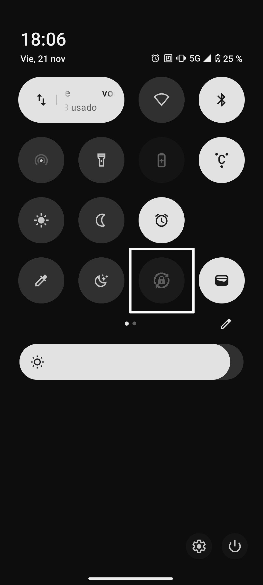

<div align="center">
  
  
  <h1>Wallpaper Changer for Nothing Phone (1)</h1>

  <p align="center">
    <a href="https://opensource.org/licenses/MIT"></a>
    
  </p>

  <p>
    <b>A high-performance, privacy-focused lock screen manager.<br>Built by a Nothing user, for Nothing users.</b>
  </p>
  <p>
    <sub>Disclaimer: This is an independent, community-made tool. Not affiliated with or endorsed by Nothing Technology Limited.</sub>
  </p>
</div>


---

## 📱 The "Why"

I love my Nothing Phone (1), but I missed a feature many other OS have: **changing the lock screen wallpaper every time I lock the phone.**

There weren’t many solutions on the Play Store and the ones I found were either outdated, unreliable, or just didn’t have the "changing on unlock" feature. As a Computer Science student, I decided to build my own solution that prioritizes **performance and user comfort/control**.

**While optimized for Nothing OS as it has been tested on Nothing Phone (1), this app works on any device running Android 12+.**

---

## ✨ Key Features

* **⚡ Instant Switch:** Zero lag. The app intelligently prepares the next wallpaper in the background so it's ready the moment you wake your device.
* **🔋 Smart Battery Awareness:** Automatically pauses activity when your phone enters Power Saving Mode or battery is low.
* **🎛️ Quick Settings Tile:** Toggle the service instantly from your control center without opening the app giving easy access from anywhere in the phone.
* **↩️ Auto-Revert:** Optionally restores your original "Default" wallpaper when the service stops, so you never lose your favorite setup.
* **🔒 Privacy First:** No internet permission required. Your images never leave your device.

---

## 📸 Screenshots

| Home Dashboard | Quick Settings Tile |
|:---:|:---:|
|  |  |

---

## 🚀 Installation

### For Users
1.  Go to the [Releases Page]([LINK_TO_YOUR_RELEASES_PAGE]).
2.  Download the latest `.apk` file.
3.  Install on your Android device (You may need to allow "Install from Unknown Sources").
4.  **Grant Permissions:** Allow "Notifications" (required to keep the service alive in the background).
5.  **Select Folder:** Open the app and choose the folder containing your wallpapers.

### Build from Source (Developers)
```
git clone https://github.com/NineCSdev/nothing-wallpaper-changer.git
cd wallpaper-changer
# Open in Android Studio and sync Gradle
```

---

## 🛠️ Technical Architecture

For developers and curious minds, this project prioritizes concurrency and memory safety:

* **Service Architecture:** Built on a `ForegroundService` rather than standard schedulers to guarantee instant execution. It listens for `ACTION_SCREEN_OFF` via a registered `BroadcastReceiver`.
* **Memory Strategy:** Implements **Bitmap Preloading**. The next wallpaper is decoded and loaded into RAM immediately after the previous lock event, ensuring 0ms latency when the user wakes the device.
* **Storage Security:** Utilizes Android's `Storage Access Framework` (SAF) to read only the specific folder granted by the user, avoiding broad file system permissions.
* **Concurrency:** Uses `AtomicBoolean` and synchronized locks (`wallpaperLock`) in the `ScreenOffReceiver` to prevent race conditions if the user locks/unlocks rapidly.
* **State Management:** Centralized `AppPreferences` singleton for thread-safe state handling across the Service, Activity, and Tile.

---
## 🧠 AI-Augmented Development (Modern Learning Workflow)

This is my first native Android project, and I used it as a deep dive into Android’s background services, wallpaper APIs, and system event architecture.
To accelerate the learning curve, I used AI tools in the role of a senior Android mentor — helping me understand native patterns, clarify system behavior, and explore implementation options.

As the architect of the project, I designed the core constraints and structure myself
(concurrency locking, battery-aware service behavior, and cache management).
AI assistance was used to speed up boilerplate, validate approaches, and clarify unfamiliar Android internals, allowing me to focus on the system logic, safety, and overall stability.

This workflow reflects my philosophy as a student developer:
use modern tools to learn faster, build better, and stay fully responsible for the architecture and final implementation.

---
## 👤 Author

NineCSdev (CS student @ UPM)

[Github](https://github.com/NineCSdev)
