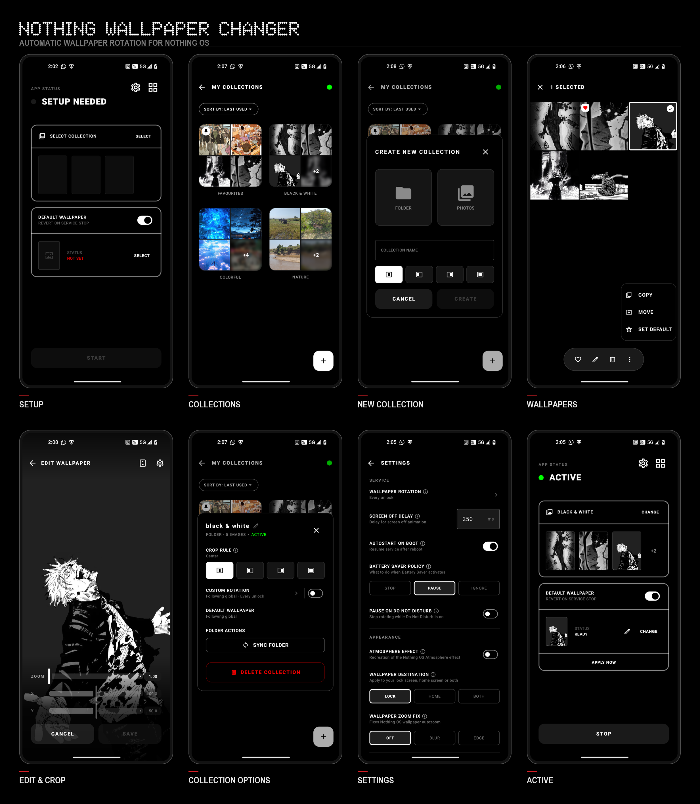

<div align="center">
  

  <h1>Wallpaper Changer for Nothing OS</h1>

  <p align="center">
    
    
    
    
  </p>

  <p>
    <b>A lightweight wallpaper changer for your lock screen, home screen, or both.<br>Built by a Nothing user, for Nothing users.</b>
  </p>
  <p>
    <sub>Disclaimer: This is an independent, community-made tool. Not affiliated with or endorsed by Nothing Technology Limited.</sub>
  </p>
</div>

---

<a id="closed-beta"></a>

## 📣 The app is on Google Play (as a closed beta), and it needs testers

> **This is the single most useful thing you can do for this project.** Google requires a personal
> developer account to run a closed test with a minimum number of opted-in testers, for a sustained
> period, before the app is allowed a public Play Store listing. That requirement is the *only* thing
> between this app and a normal Play listing.
>
> **Already have the app installed from an APK? [Export a backup first](#coming-from-apk)**
>
> ### **[👉 Join the closed beta group](https://groups.google.com/g/wallpaper-changer-testers)**
>
> **Tap the link, join the group and follow the instructions there.** Nothing is reported back to me, and 
> the app still has zero internet permissions [privacy policy](docs/privacy.md). 
> Leave any time from the same link.
>
> Sideloading stays fully supported, APK is on the [Releases page](https://github.com/NineCSdev/nothing-wallpaper-changer/releases).

<a id="coming-from-apk"></a>

### ⚠️ Already running the app from an APK? Export a backup first.

**Play cannot update an app you installed from an APK here (you can become a tester without installing via Play Store join the group for more info).** These APKs are signed with my key, Play signs its deliveries with Google's. So moving to Play means uninstalling first. Because of this this release ships backup and restore, so follow these steps:

1. **[Update to v0.4.0](https://github.com/NineCSdev/nothing-wallpaper-changer/releases)**.
2. **Export:** Settings → **BACKUP** → **EXPORT BACKUP**. Save the `.nwcbak` file anywhere outside the app (Downloads).
3. **[Join the closed beta group](https://groups.google.com/g/wallpaper-changer-testers)** and follow the instructions there.

**Keep the backup file until you have checked the restore.** And if you would rather not move at all, nothing forces you to.

---

##  The "Why"

I love my Nothing Phone (1), but I missed a feature many other OS have: **changing the lock screen wallpaper every time I lock the phone.**

There weren't many solutions on the Play Store and the ones I found were either outdated, unreliable, or just didn't have the "changing on unlock" feature. As a Computer Science student, I decided to build my own solution that prioritizes **performance and user comfort/control**.

**While optimized for Nothing OS as it has been tested on my Nothing Phone (1), this app works on any device running Android 13+.**

---

##  Key Features

- **Instant Wallpaper Swap:** Each wallpaper is pre-processed and ready to go before you lock your phone, resulting in no lag and no loading screens. *(Achieved via a disk-buffered pipeline: downsample → crop → WebP.)*
- **Atmosphere Effect:** A reimplementation of Nothing's Atmosphere effect. Your wallpaper sits sharp on the lock screen and, the moment you unlock, it dissolves into a slow, drifting arrangement of colour blobs taken from that photo's own palette, and becomes your home screen wallpaper.
- **Wallpaper Collections:** Organize wallpapers in two ways:
    - **Folder-based:** Point the app at a folder on your device and it picks up all the images inside, with re-sync on demand. In-app deleting an image makes it not sync until it is restored.
    - **Manual:** Hand-pick individual photos. By default they're referenced where they already live, so they cost no extra storage. Flip **Keep local copies** in Settings if you'd rather have in-app copies.
- **Per-Image Wallpaper Editor:** Crop, zoom, and position individual wallpapers with pinch-to-zoom, precision sliders you can also type exact values into, undo, and a fit-to-height control. Edits are applied on the fly to not use extra storage.
- **Rotation Cadence:** Rotate on every lock, on predefined intervals, on a custom interval (5 minutes to 30 days), or once per day. Set it globally in Settings and customize it per collection.
- **Default Wallpaper Fallback:** Pick a fallback image that's automatically restored when the service stops. It's editable, can be applied on demand, and any collection can nominate one of its own wallpapers to override it.
- **Wallpaper Zoom Fix:** Counteracts the auto-zoom some phones (especially Nothing OS) apply to screen wallpapers. Choose between blurred-edge or sharp-edge padding modes, or turn it off. Applied to both rotating and default wallpapers.
- **Backup & Restore:** Save the whole app to a single `.nwcbak` file: every collection, every image's framing, etc. Restoring shows you what is in the file and changes nothing until you confirm.
- **Privacy First:** No internet permissions. Your images never leave your device.

<details>
<summary><b>Everything else it does</b> (15 more)</summary>

- **Configurable Wallpaper Destination:** Apply the rotation to the lock screen, the home screen, or both.
- **Favourites:** Heart any wallpaper to add it to a built-in Favourites collection.
- **Pinned Collections:** Pin the collections you use most so they sort to the top. Tap a collection to browse its wallpapers, long-press for pin, set-active, and edit actions.
- **Copy & Move Between Collections:** Move or copy wallpapers across collections edits included, no re-picking.
- **Collection Image Gallery:** Browse all wallpapers in a collection with a 3-column grid and multi-select for batch operations. The full-screen preview is now a proper gallery viewer.
- **Smart Shuffle:** Every image is shown exactly once before the collection reshuffles in order to never getting any individual wallpaper too often.
- **Flexible Cropping:** Choose how images fit your screen per collection: center, left-aligned, right-aligned, or fit-to-screen.
- **Settings Screen:** Customize exactly how you want the app to behave, with tons of settings to tweak.
- **Quick Settings Tile:** Start, stop, or check status right from the notification shade letting you control it while doing something else.
- **Survives Reboots:** If the service was running before a restart, it picks right back up.
- **Battery Aware:** Choose what happens during Battery Saver: stop the service, pause and auto-resume, or keep running.
- **Do Not Disturb Aware:** Optionally pause rotation while your phone is in DnD. It resumes on its own when DnD ends.
- **Language Selection:** Switch the app's language from Settings. English and Spanish are fully supported today.
- **Self-Healing, Never Destructive:** Failed images are retried. An image whose source has genuinely gone away is **marked unavailable and badged**, and it comes back on its own if the source returns. You can also re-link a broken image to a new source by tapping it, keeping every collection membership and edit intact.

</details>

---

## Screenshots
<td></td>

---

## FAQ

<details>
<summary><b>Will this drain my battery?</b></summary>

No. The app never wakes your phone. On the default "every lock" rotation it simply waits for the screen to turn off, then swaps the wallpaper, the actual work (processing one image) takes a fraction of a second. If you pick a timed rotation instead, the timer only runs while the screen is already on: there's no alarm, no background job, and nothing scheduled to fire while your phone is asleep. It also *(depending on user configuration)* pauses automatically during Battery Saver and Do Not Disturb.
</details>

<details>
<summary><b>How much storage does it use?</b></summary>

Almost none by default. As of v0.3.3 the app tries **reference** your images where they already are instead of copying them:

- **Folder collections:** None. The app reads the images straight out of the folder you pointed it at.
- **Manual collections:** None by default. Picked photos are stored as references to your gallery.
- **The same photo in several collections** is stored once and shared, so copying wallpapers between collections is free.
- **If you turn on "Keep local copies"** in Settings, newly added photos are copied into the app's private storage as compressed WebP files at screen resolution. Expect roughly **0.2–1 MB per image**. Settings shows a live readout of how much space those copies use. The toggle only affects photos added *after* you flip it.
- A single **buffer file** (~1 MB) is kept ready for the next wallpaper. With Atmosphere effect that buffer is a slightly larger container holding the image plus its extracted palette. That's it.
</details>

<details>
<summary><b>Can I back the app up, or move it to a new phone?</b></summary>

Yes. Settings → **BACKUP** writes one `.nwcbak` file holding every collection, every image's framing, the images you removed from folder collections, your default wallpapers and all your settings. You choose where it goes, so it survives uninstalling the app. Two kinds:
- **The default** keeps your *Keep local copies* behaviour, restores perfectly **on the same phone**.
- **Include every image** copies the photos themselves into the file as well. It is what you want for **a different phone**.

Restoring replaces everything in the app. It reads the file first and shows you what is inside, and nothing changes until you confirm.
</details>

<details>
<summary><b>Why is there a permanent notification?</b></summary>

Android requires any app doing background work to show a notification, it's a system rule, not a design choice. The notification is as minimal as possible, lets you see the service is running and which collection is active, and tapping it opens the app.
</details>

<details>
<summary><b>What is the Atmosphere effect, and does it replace Nothing's own?</b></summary>

It's a live wallpaper this app renders itself. Your photo shows sharp on the lock screen, and when you unlock it morphs into a slow drift of colour blobs derived from that photo's palette. Rotation keeps running underneath, so each new wallpaper brings its own colours.

It is **this app's effect, not Nothing's.** Turning it on sets this app as your live wallpaper, replacing whatever you had. Turning it off puts a real static wallpaper back (the image the effect was last showing, or your default wallpaper, or the system's built-in one) but it cannot restore Nothing's built-in Atmosphere. You'd set that again from the system wallpaper picker.

One consequence of it being a live wallpaper: Android live wallpapers cover both the lock and home screens, so the **wallpaper destination** setting has no effect while Atmosphere is on.
</details>

<details>
<summary><b>Does the Atmosphere effect drain my battery?</b></summary>

It only animates when there's something to animate. The morph plays once per unlock and then stops on a still frame. So most of the time the effect is a static image on and it will consume just a bit more than a normal wallpaper.
</details>

<details>
<summary><b>The app stopped working or does not restart after reboot</b></summary>

While in Nothing OS this shouldn't happen, other phone manufacturers (Xiaomi, Samsung, Huawei, etc.) aggressively kill background apps. Check [dontkillmyapp.com](https://dontkillmyapp.com) for device-specific instructions.
</details>

<details>
<summary><b>Does this change my home screen wallpaper too?</b></summary>

It can. Go to Settings and choose whether the rotation applies to the lock screen, the home screen, or both. Lock screen only is the default.
</details>

<details>
<summary><b>Does the app have access to all my photos?</b></summary>

The app asks for photo access (`READ_MEDIA_IMAGES`) because it needs to keep reading the wallpapers you picked, in the background, for as long as they're in a collection as that's the whole point of the app. Android 14+ also lets you grant access to **selected photos only** if you prefer but the app treats this as if **no photo access was granted** as currently it doesn't track which photos you give access to.

It only ever reads the images you actually added to a collection. When you select a folder, you're granting access to only that specific folder. The app has **zero internet permissions**, so nothing ever leaves your device, and if you decline photo access the app falls back to keeping private copies of the photos you pick.
</details>

<details>
<summary><b>What is the wallpaper zoom fix?</b></summary>

Some phones (especially Nothing OS) automatically zoom/crop the wallpaper for a parallax effect. The wallpaper zoom fix adds hidden padding around your wallpaper so the zoom crops the padding instead of your image. Choose "Blur" for a blurred-edge extension or "Edge" for sharp edge-stretching in case the zoom isn´t applied (it sometimes happen), or leave it off if you don´t mind the zoom or your phone doesn´t apply it.
</details>

---

## Installation

### From Google Play (recommended)

> **Already have the app installed from an APK? [Export a backup first](#coming-from-apk).** Play
> cannot update a sideloaded install.

1.  **[Join the closed beta group](https://groups.google.com/g/wallpaper-changer-testers)** and follow the instructions there.
2.  Install from the Play Store.
3.  Updates then arrive automatically. See [the section at the top](#closed-beta) for why the tester count matters.

### From the APK

1.  Go to the [Releases Page](https://github.com/NineCSdev/nothing-wallpaper-changer/releases).
2.  Download the latest `.apk` file.
3.  Install on your Android device (you may need to allow "Install from Unknown Sources").

### Either way

4.  **Grant Permissions:** Allow "Notifications" (required to keep the service alive in the background), and photo access if you want your picks referenced rather than copied.
5.  **Create a collection:** Open the app and create a collection either by selecting a folder or individual photos.

### Build from Source
```bash
git clone https://github.com/NineCSdev/nothing-wallpaper-changer.git
cd nothing-wallpaper-changer
# Open in Android Studio and sync Gradle
# Requires JDK 17, Android SDK 37
./gradlew assembleDebug        # macOS / Linux
gradlew.bat assembleDebug      # Windows
```

A `release` build needs a signing key, supplied either as a gitignored `keystore properties` or through `ANDROID_KEYSTORE_*` environment variables. Without either it still builds, unsigned, with a warning.

---

## Architecture

The app uses a **single-activity Jetpack Compose UI**, **Hilt** for dependency injection, **Room** for collections and images, a **WallpaperRepository** for collection/rotation coordination, a **ServiceLifecycle** authority for service state, a **foreground service** that rotates wallpapers, and a separate **live wallpaper service** for the Atmosphere effect.

The current implementation uses Hilt-injected app-level dependencies, plain `@HiltViewModel` ViewModels, lifecycle-aware Compose state collection, and Preferences DataStore for lightweight app flags. Navigation is handled by Navigation Compose with six routes: main dashboard, collections, collection image gallery, wallpaper editor, settings, and backup. The current architecture is documented in [docs/ARCHITECTURE.md](docs/ARCHITECTURE.md).

### How It Works

1. **User creates a collection** (folder or manual) → images are stored in Room.
2. **User browses and edits wallpapers** → the collection image gallery shows all images in a grid; tapping opens a full-screen gallery viewer; the per-image editor lets you crop and position with gestures, sliders, or typed values.
3. **User presses Start** → `WallpaperService` starts as a foreground service, loads & shuffles the active collection into an in-memory magazine, and pre-processes the first wallpaper into a disk buffer. Edited images are preferred over originals.
4. **A rotation comes due** → either on screen-off (`ScreenStateReceiver`) or when a time-based cadence elapses while the screen is on (`RotationScheduler`). Both call one `RotationCoordinator`, which checks the collection's cadence, applies the prepared wallpaper, and prepares the next.
5. **Delivery forks on the wallpaper mode** →
   - **Static:** the buffer is streamed to `WallpaperManager.setStream()` on whichever surface(s) the destination setting targets.
   - **Atmosphere:** the buffer plus its extracted palette is handed to the live wallpaper engine, which holds it until the screen is genuinely dark, then swaps it in and reports back.
6. **Battery Saver or Do Not Disturb** → the configured policy is applied: stop, pause and auto-resume, or ignore.
7. **User presses Stop** → Service stops; if "revert to default" is enabled, the default wallpaper is restored, the active collection's own override if it has one, otherwise the global default (including wallpaper zoom fix if enabled).
8. **Device reboots or the app updates** → `ServiceRestartReceiver` checks persisted state and restarts the service if it was previously meant to be running.

---

## Tech Stack

| Category      | Library / API                       |
|---------------|-------------------------------------|
| Language      | Kotlin 2.3 (JVM 17)                 |
| UI            | Jetpack Compose + Material 3        |
| Graphics      | OpenGL ES 2.0 (GLSL)                |
| Image loading | Coil 2.7                            |
| Database      | Room 2.8 (KSP)                      |
| Preferences   | Jetpack Preferences DataStore       |
| DI            | Hilt                                |
| Async         | Kotlin Coroutines + `SupervisorJob` |
| Lifecycle     | ViewModel + StateFlow / SharedFlow  |
| Min SDK       | 33 (Android 13)                     |
| Target SDK    | 37                                  |

---

## Permissions

| Permission                                              | Reason                                                                                             |
|---------------------------------------------------------|----------------------------------------------------------------------------------------------------|
| `SET_WALLPAPER`                                         | Apply wallpapers to the screen                                                                     |
| `FOREGROUND_SERVICE` / `FOREGROUND_SERVICE_SPECIAL_USE` | Keep the rotation service alive in the background                                                  |
| `POST_NOTIFICATIONS`                                    | Show the required foreground service notification                                                  |
| `RECEIVE_BOOT_COMPLETED`                                | Restart the service after a reboot                                                                 |
| `READ_MEDIA_IMAGES` / `READ_MEDIA_VISUAL_USER_SELECTED` | Keep reading the photos you added to a collection, in the background, for as long as they're in it |

No internet permission is requested, your images never leave your device. See the full
[privacy policy](docs/privacy.md).

---

## Development Approach

This is my first native Android project, built while actively learning about background services, wallpaper APIs, and system event architecture. I used AI tools as a learning accelerator for understanding unfamiliar Android internals and validating implementation approaches while iterating on the architecture and refining concurrency and system-level decisions.

---

## Status

**v0.4.0-beta** is the Atmosphere release, and the largest feature the app has ever shipped. It is also the first version to go up to Google Play, as the [closed beta](#closed-beta) described at the top.

**A second way to deliver your wallpapers.** Alongside the static swap, the app can now render your photo as a live wallpaper that morphs on unlock into a drifting field of colour built from that photo's own palette. Rotation runs underneath it.

**Rotation became a setting.** It can now be set globally (applying to every collection) and can happen on every lock, a custom interval (5 minutes to 30 days), or once a day. It is still customizable per collection and can be also pause during Do Not Disturb.

**The default wallpaper is now editable.** It's editable in the normal editor, applyable on demand, and any collection can set one of its own images to override it when the service stops.

**Backup and restore.** The whole app writes to one file you keep wherever you like: collections, framing, removed images, default wallpapers and settings. It is what makes moving to the Play build, or to a new phone, survivable.

**Plus a UI pass:** the full-screen preview rebuilt as a gallery viewer with pinch, pan, double-tap and swipe; typed zoom and offset fields in the editor; Settings regrouped into four sections.

---

## Author

NineCSdev (CS student @ UPM)

[GitHub](https://github.com/NineCSdev)
